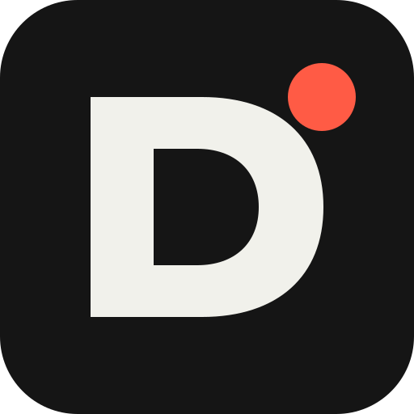
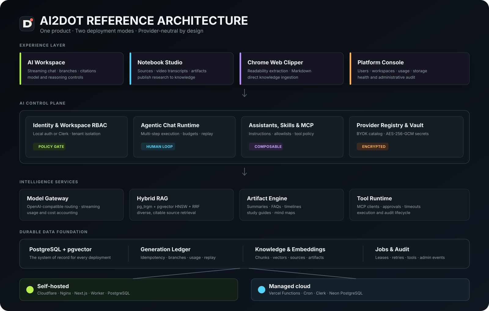

<div align="center">
  
  <h1>ai2dot</h1>
  <p><strong>A deployable AI workspace for conversations, agents, knowledge, research, and operations.</strong></p>
  <p>Run it on your own Docker infrastructure or ship the same application on Vercel and Neon.</p>

  <p>
    <a href="https://ai2note.com"><strong>Product Site</strong></a> ·
    <a href="https://ai.ai2dot.com"><strong>Cloud App</strong></a> ·
    <a href="./docs/docker-linux-deployment.zh-CN.md"><strong>Deployment Guide</strong></a> ·
    <a href="./README.zh-CN.md"><strong>简体中文</strong></a>
  </p>

  <p>
    
    
    
    
    
    
  </p>
</div>

---

## Product Overview

ai2dot turns fragmented AI tools into one governed workspace. Teams can connect their own model providers, build reusable assistants, ground conversations in private knowledge, run approved MCP tools, turn research sources into structured artifacts, and monitor the platform from an independent administration console.

The application is provider-neutral and deployment-neutral by design. The same domain model, Drizzle migrations, authorization boundaries, generation ledger, and retrieval engine run in both environments:

- **Self-hosted:** Docker Compose, Next.js standalone, Nginx, PostgreSQL + pgvector, and an optional Cloudflare Tunnel.
- **Cloud:** Vercel Functions, Vercel Cron, Clerk, and Neon PostgreSQL + pgvector.

## What Is Included

| Surface | Production capability |
| --- | --- |
| **AI Workspace** | Streaming chat, model switching, deep reasoning controls, persistent conversations, rolling context summaries, and non-destructive branches. |
| **Assistants** | Reusable system instructions with a selected model, knowledge bases, and an explicit MCP source allowlist. |
| **Agentic Tools** | Multi-step MCP execution with step/time budgets, automatic approval for read-only tools, human approval for write or unknown-risk tools, and durable audit records. |
| **Knowledge** | PDF, DOCX, TXT, Markdown, CSV, and JSON ingestion with PostgreSQL full-text/trigram candidates, pgvector semantic candidates, RRF fusion, and citations. |
| **Notebook Studio** | Research spaces, files and pasted sources, YouTube/Bilibili transcript sources, source search, editable artifacts, and one-click publication to the knowledge base. |
| **Skills** | Workspace-scoped `SKILL.md` instruction packages with metadata parsing, relevance matching, versioning, fingerprints, and MCP dependency hints. |
| **Web Clipper** | Chrome Manifest V3 side panel that extracts the current page, generates Markdown with a workspace model, and saves it to a selected knowledge base. |
| **Operations** | Provider health, usage, token and cost telemetry, generation replay, PostgreSQL rate limiting, background embedding jobs, and structured logs. |
| **Platform Console** | Separate local administrator identity, user status controls, workspace inventory, storage and usage views, and administrative audit history. |

## Reference Architecture

<p align="center">
  
</p>

The control plane is intentionally stateless between requests. PostgreSQL owns authorization-relevant state, idempotency, leases, job progress, tool audit events, and external bindings. Docker may add process-local caches for performance, but correctness never depends on them; Vercel can therefore execute the same workflows across cold starts and concurrent functions.

## Core Engineering Principles

### Provider ownership without lock-in

Connect OpenAI, OpenRouter, DeepSeek, ZenMux, Google Gemini, or any compatible endpoint. Provider credentials are encrypted with AES-256-GCM before they are stored and are never returned to the browser. Vercel AI Gateway remains optional.

### Tool use with explicit boundaries

An assistant can only see MCP sources assigned to it. Ordinary chats require users to select a source explicitly. Read-only tools can run automatically; write, destructive, and unknown-risk operations require human approval. Requests, approvals, executions, and outcomes are recorded in PostgreSQL.

### Retrieval that survives provider outages

Knowledge search combines `pg_trgm` keyword recall with pgvector HNSW semantic recall and reciprocal-rank fusion. Embeddings can use a workspace-owned OpenAI-compatible provider. If embedding generation is unavailable, search degrades to keyword retrieval instead of taking the workspace offline.

### Durable AI operations

Every persistent generation has a UUID idempotency key, a SHA-256 request fingerprint, and an explicit lifecycle. Completed responses can be replayed without a second upstream charge. Embedding work uses PostgreSQL leases, retries, and idempotent updates so interrupted functions or containers can resume safely.

## Notebook Studio

Notebook Studio connects research and the knowledge base in one workflow:

1. Create a research space linked to its own knowledge base.
2. Add documents, pasted text, or a YouTube/Bilibili URL with a transcript or subtitle file.
3. Search all sources with the same hybrid retrieval engine used by chat.
4. Generate a summary, FAQ, timeline, study guide, or mind map with a selected workspace model.
5. Review and edit the Markdown artifact.
6. Publish the result back to the knowledge base for future retrieval.

Gemini Enterprise Notebook is designed as an **optional external provider**. The repository currently includes provider configuration and readiness checks; production OAuth, notebook/source synchronization, and report import are specified in the integration document and remain behind a feature flag. ai2dot's native Notebook Studio continues to work without Google services.

See [Gemini Enterprise Notebook integration design](./docs/google-notebook-enterprise-integration.zh-CN.md).

## Security Model

- Workspace-level authorization on persistent resources and APIs.
- Local signed HttpOnly sessions or Clerk authentication.
- Separate platform-admin identities and sessions.
- AES-256-GCM encryption for model and MCP credentials.
- HTTPS-only external MCP endpoints with DNS/IP validation and private-network blocking.
- Human approval for mutating or unclassified MCP tools.
- Append-oriented generation records and tool audit trails.
- PostgreSQL-backed rate limiting across multiple application instances.
- Non-root production containers; PostgreSQL is not published to the host by default.

Security features reduce operational risk but do not replace an organization-specific threat model, secret rotation policy, network policy, or compliance review.

## Quick Start

### Local development

Requirements: Node.js 20.9+ and npm.

```bash
git clone https://github.com/free2way/ai2dot.git
cd ai2dot
npm install
cp .env.example .env.local
npm run dev
```

Open `http://localhost:3000`. Without authentication or a database, ai2dot starts in a local demonstration mode. Configure authentication, PostgreSQL, and a model provider to enable persistent workspaces.

### Docker deployment

```bash
cp .env.example .env

# Add the generated scrypt hash to AI2DOT_LOCAL_AUTH_PASSWORD_HASH.
npm run auth:hash-password -- 'replace-with-a-strong-password'

docker compose up -d postgres
docker compose --profile tools run --rm migrate
docker compose up -d --build app proxy
docker compose ps
```

The production image uses Next.js standalone output and runs as a non-root user. Nginx provides compression, connection reuse, immutable static-asset caching, and unbuffered streaming responses. PostgreSQL data is stored in the `ai2dot_postgres-data` volume.

For host preparation, backups, Cloudflare Tunnel, Clerk, health checks, rollback, and restore procedures, use the [Docker + Linux deployment guide](./docs/docker-linux-deployment.zh-CN.md).

### Vercel deployment

1. Create a Neon PostgreSQL database with `pgvector` and `pg_trgm`.
2. Configure pooled `DATABASE_URL` and unpooled `DATABASE_URL_UNPOOLED`.
3. Add Clerk or the required authentication variables.
4. Add `PROVIDER_SECRET_ENCRYPTION_KEY` and model-provider configuration.
5. Deploy with `npm run vercel-build`; migrations run before the Next.js build.
6. Configure the embedding recovery cron endpoint with `CRON_SECRET`.

The full runtime comparison is documented in [Docker and Vercel dual-runtime architecture](./docs/dual-runtime-architecture.zh-CN.md).

## Configuration

| Area | Important variables |
| --- | --- |
| Database | `DATABASE_URL`, `DATABASE_URL_UNPOOLED`, `DATABASE_POOL_MAX` |
| Authentication | `AI2DOT_AUTH_MODE`, `AI2DOT_SESSION_SECRET`, Clerk keys |
| Local login | `AI2DOT_LOCAL_AUTH_EMAIL`, `AI2DOT_LOCAL_AUTH_PASSWORD_HASH` |
| Credential vault | `PROVIDER_SECRET_ENCRYPTION_KEY` |
| AI Gateway | `AI_GATEWAY_API_KEY`, `AI2DOT_ENABLE_AI_GATEWAY` |
| Embeddings | `AI2DOT_EMBEDDING_*` |
| Agent controls | `AI2DOT_TOOL_APPROVAL_SECRET`, MCP source configuration |
| Background work | `CRON_SECRET`, embedding batch and lease settings |
| Docker | `AI2DOT_PORT`, `AI2DOT_NODE_MEMORY_MB`, PostgreSQL variables |

See [`.env.example`](./.env.example) for the complete, annotated list. Never commit `.env`, OAuth secrets, database credentials, tunnel tokens, or provider API keys.

## Repository Map

```text
src/app/                 Next.js App Router pages and Route Handlers
src/components/          Workspace, admin, knowledge, notebook, and marketing UI
src/server/              Auth, database, providers, MCP, knowledge, and operations
src/lib/                 Shared domain types, policies, parsing, and presentation data
drizzle/                 Versioned PostgreSQL migrations
extension/               Chrome Manifest V3 web clipper
deploy/                  Nginx and deployment assets
docs/                    Architecture, deployment, extension, and database guides
compose.yaml             Self-hosted production topology
Dockerfile               Multi-stage Next.js standalone image
```

## Development Quality Gates

```bash
npm run lint
npm run typecheck
npm test
npm run build
```

GitHub Actions executes the same application checks. The Chrome extension has its own typecheck, test, build, and packaging commands under `extension/`.

## Documentation

- [Docker + Linux reproducible deployment](./docs/docker-linux-deployment.zh-CN.md)
- [Docker and Vercel dual-runtime architecture](./docs/dual-runtime-architecture.zh-CN.md)
- [pgvector installation and verification](./docs/pgvector-installation-and-verification.zh-CN.md)
- [Chrome extension development](./docs/chrome-extension-development.zh-CN.md)
- [Notebook Studio development](./docs/notebook-studio-development.zh-CN.md)
- [Gemini Enterprise Notebook integration](./docs/google-notebook-enterprise-integration.zh-CN.md)
- [Technical implementation plan](./TECHNICAL_PLAN.md)
- [Technical acceptance plan](./TECHNICAL_ACCEPTANCE_PLAN.md)

---

<div align="center">
  <strong>ai2dot</strong><br />
  Own the workspace. Choose the models. Keep the operating boundary visible.
</div>
