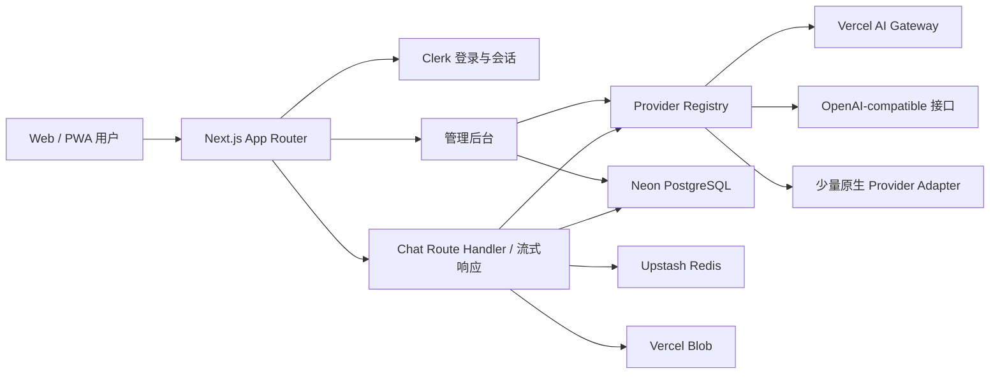

# AI 聚合助手技术落地方案

> 状态：Draft v1  
> 日期：2026-08-08  
> 目标：先完成一个可登录、可选择多模型、可保存上下文、可在 Vercel 稳定运行的 AI 聚合助手，再逐步增加知识库、工具调用和长期记忆。
> 配套验收：`TECHNICAL_ACCEPTANCE_PLAN.md`

## 1. 结论

建议采用以下主栈：

- Web 全栈：Next.js App Router + TypeScript + React
- AI 接入：Vercel AI SDK + Vercel AI Gateway + OpenAI-compatible 自定义适配器
- UI：Tailwind CSS + shadcn/ui，聊天组件按产品风格自行封装
- 登录：Clerk；业务库仅保存 `externalUserId` 和业务资料
- 数据库：Neon PostgreSQL + Drizzle ORM
- 缓存与限流：Upstash Redis
- 文件：Vercel Blob
- 部署：Vercel Git Integration；每个 PR 自动生成 Preview，验证后再发布生产环境
- 监控：Vercel Logs/Observability + Sentry（P1）
- 测试：Vitest + React Testing Library + Playwright

首版推荐做成一个模块化单体，而不是拆微服务。页面、API、鉴权和数据访问在一个 Next.js 项目中，模型调用通过内部 Provider Registry 隔离。它足够支撑 MVP 和早期用户量，后续可以单独拆出异步任务或模型网关，而不必一开始承担分布式系统复杂度。

## 2. 产品范围与默认假设

本方案先按以下默认条件落地：

- 首版是个人/小团队产品，但数据库从第一天保留 `workspace` 边界，方便以后发展成 SaaS。
- 首版由平台方配置模型密钥；P1 再支持用户自带密钥（BYOK）。
- 默认部署到 Vercel，服务端运行时使用 Node.js，不把核心聊天路由放到 Edge Runtime。
- 首版支持文字、图片/文件输入、Markdown/代码块输出；语音、图片生成和视频作为后续能力。
- 中文优先，同时预留 i18n。

如果产品主要服务中国大陆用户，需要在开发前单独确认 Clerk、Vercel 和上游模型服务的网络可达性与合规要求；这可能影响登录服务和部署区域选择。

## 3. 系统架构



一次聊天请求的主流程：

1. 前端提交 `conversationId`、`modelId`、消息内容和附件引用。
2. 服务端验证登录、会话归属、模型状态、额度和请求参数。
3. 先持久化用户消息，再根据上下文预算组装模型输入。
4. Provider Registry 根据模型记录选择 Gateway、兼容接口或原生适配器。
5. AI SDK 将响应流式返回前端，同时收集工具调用、token 用量和结束原因。
6. 流完成后持久化助手消息和用量；异常时也保存可恢复的消息状态。

## 4. 模型接入与动态刷新

### 4.1 三层接入策略

第一层：Vercel AI Gateway

- 作为默认入口，用一个统一接口覆盖大量主流模型。
- 模型列表从 `GET https://ai-gateway.vercel.sh/v1/models` 获取，而不是硬编码。
- 后台提供“立即刷新”，并通过 Vercel Cron 每天同步一次模型、上下文长度、输入输出模态和价格。
- 支持 Gateway 的 provider routing、fallback、预算和用量能力。

第二层：OpenAI-compatible Provider

- 管理员可配置 `name`、`baseUrl`、`apiKey`、可选 headers 和模型发现路径。
- 适用于支持 OpenAI Chat Completions/Responses 风格协议的第三方平台、本地网关或自建模型。
- 后台先测试连接，再同步 `/models`；若对方没有模型列表接口，可手工添加模型。

第三层：原生 Provider Adapter

- 仅用于协议不兼容或需要专属能力的服务。
- 每个适配器实现统一的模型创建、模型同步、能力映射和错误归一化接口。
- 新协议仍需开发和部署；不能承诺任意未知协议都能通过后台配置零代码接入。

### 4.2 内部统一模型标识

不要让聊天业务直接依赖供应商模型字符串。内部使用稳定 ID：

```text
model record id: mdl_xxx
canonical key: connectionId/providerModelId
display name: Claude Sonnet / GPT / Gemini ...
source: gateway | openai-compatible | native
capabilities: text, image_input, file_input, tools, reasoning, image_output...
```

一次对话还应保存当时的模型快照，包括模型名、供应商、参数、上下文窗口和价格。即使后续模型被下架，旧记录仍然可读、可审计。

### 4.3 Provider Registry 接口

```ts
interface ProviderAdapter {
  testConnection(connectionId: string): Promise<ConnectionTestResult>;
  syncModels(connectionId: string): Promise<DiscoveredModel[]>;
  getLanguageModel(model: ModelRecord): Promise<LanguageModel>;
  normalizeError(error: unknown): NormalizedAIError;
}
```

Registry 负责：

- 根据数据库配置创建模型实例
- 解密服务端密钥，但绝不把密钥发送到浏览器
- 校验模型能力与请求是否匹配
- 统一超时、重试、fallback 和错误文案
- 记录首 token 延迟、总耗时、token 和估算成本

## 5. Chat 与上下文设计

### 5.1 前端布局

- 左栏：搜索、会话列表、文件夹/标签、新建会话
- 中栏：消息流、流式输出、Markdown、代码高亮、复制、停止、重试、编辑、分支
- 顶栏：助手选择、模型选择、联网/工具开关、上下文用量
- 输入区：多行输入、拖拽/粘贴附件、快捷指令、参数面板
- 右侧抽屉：会话设置、系统提示词、温度/推理强度、知识库、记忆

移动端将左栏和右侧设置改为 Drawer；聊天输入区固定在安全区域上方。

### 5.2 消息格式

消息不能只存一列纯文本，建议以 AI SDK UI message parts 的思路存 `parts JSONB`：

- text
- reasoning（按模型和产品策略决定是否显示）
- image/file
- tool-call / tool-result
- citation/source
- error/status

同时保存 `parentMessageId`，支持“编辑后重发”“重新生成”和对话分支，而不用复制整段历史。

### 5.3 上下文策略

数据库保存完整历史，但每次请求不应无上限地发送全部消息。上下文构造顺序：

1. 助手系统提示词与安全规则
2. 用户固定记忆和当前工作区规则
3. 较早对话的滚动摘要
4. 最近消息窗口
5. 当前检索到的知识库片段或工具结果
6. 当前用户消息

按模型上下文窗口计算 token 预算，为输出预留空间。达到阈值时异步更新摘要，原消息继续保留，确保用户可查看和导出完整历史。

## 6. 数据模型

核心表建议如下：

| 表 | 关键字段 | 用途 |
|---|---|---|
| `users` | `id`, `external_auth_id`, `profile` | 业务用户映射 |
| `workspaces` | `id`, `name`, `owner_id` | 多租户边界 |
| `workspace_members` | `workspace_id`, `user_id`, `role` | owner/admin/member |
| `provider_connections` | `id`, `type`, `base_url`, `encrypted_secret`, `status` | 模型供应商配置 |
| `models` | `id`, `connection_id`, `provider_model_id`, `capabilities`, `pricing`, `enabled` | 可选模型目录 |
| `assistants` | `id`, `workspace_id`, `name`, `system_prompt`, `default_model_id`, `tool_policy` | 助手/角色 |
| `conversations` | `id`, `workspace_id`, `user_id`, `assistant_id`, `title`, `summary` | 会话元数据 |
| `messages` | `id`, `conversation_id`, `parent_id`, `role`, `parts`, `model_snapshot`, `status` | 完整消息树 |
| `attachments` | `id`, `workspace_id`, `blob_url`, `mime_type`, `size`, `metadata` | 文件与图片 |
| `usage_events` | `request_id`, `user_id`, `model_id`, `tokens`, `cost`, `latency`, `status` | 成本、额度和排障 |
| `memories` | `user_id`, `scope`, `content`, `source`, `enabled` | 可查看、可关闭的长期记忆 |
| `model_sync_runs` | `connection_id`, `status`, `stats`, `error` | 模型刷新审计 |

P1 的知识库再增加 `knowledge_bases`、`documents` 和带 pgvector 向量列的 `document_chunks`。

所有业务查询必须带 `workspace_id`/`user_id` 归属校验，不能只凭前端传入的资源 ID 查询。

## 7. 登录与权限

首版选择 Clerk，原因是 Next.js App Router 集成快、登录 UI 完整、Vercel 配置简单。支持邮箱验证码和常用 OAuth 登录。

权限层仍由本应用维护：

- `owner`：账单、供应商密钥、成员和全部数据
- `admin`：模型、助手、知识库和成员管理
- `member`：使用获授权模型与助手

Clerk 只负责身份认证；资源权限、模型权限和额度必须在服务端根据数据库判断。API Route Handler 不信任客户端传入的用户、角色或工作区信息。

如果后续要求完全自托管认证或中国大陆可达性优先，可替换为 Better Auth/Auth.js；Provider 与业务表不依赖 Clerk 的用户对象，迁移成本可控。

## 8. 安全基线

- Provider API Key 使用 AES-256-GCM 信封加密后入库，主密钥只保存在 Vercel Secret/Environment Variable 中。
- 密钥只在服务端解密，日志、错误响应、埋点和前端 payload 全部脱敏。
- 自定义 `baseUrl` 必须使用 HTTPS；阻止 localhost、内网 IP、metadata 地址和 DNS rebinding，防止 SSRF。
- 上传文件校验 MIME、扩展名和大小，私有文件使用受鉴权的短时访问方式。
- 按用户、工作区、IP 和模型做 Redis 滑动窗口限流；设置单请求 token 上限、每日预算和并发上限。
- Markdown 渲染禁用原始 HTML或严格消毒，外链增加安全属性，代码执行默认关闭。
- 工具调用默认最小权限；产生外部写操作前要求用户确认，并记录审计日志。
- 对话支持导出和彻底删除；定义数据保留策略、备份策略和隐私说明。
- 对异常费用、密钥失效、模型错误率和响应延迟设置告警。

## 9. API 边界

建议首版 Route Handlers：

```text
POST   /api/chat                         流式聊天
POST   /api/chat/:conversationId/stop    可选：跨设备停止任务
GET    /api/conversations
POST   /api/conversations
GET    /api/conversations/:id
PATCH  /api/conversations/:id
DELETE /api/conversations/:id
POST   /api/attachments
GET    /api/models                       返回当前用户可用模型
POST   /api/admin/providers
PATCH  /api/admin/providers/:id
POST   /api/admin/providers/:id/test
POST   /api/admin/providers/:id/sync
PATCH  /api/admin/models/:id
GET    /api/admin/usage
GET    /api/cron/sync-models
```

写操作使用 Zod 做运行时校验。API 返回稳定的错误码，例如 `MODEL_UNAVAILABLE`、`CONTEXT_TOO_LARGE`、`RATE_LIMITED`、`PROVIDER_AUTH_FAILED`，前端再映射成用户文案。

## 10. 推荐目录结构

```text
src/
  app/
    (auth)/sign-in/...
    (app)/chat/[[...conversationId]]/page.tsx
    (app)/assistants/...
    (admin)/admin/providers/...
    api/chat/route.ts
    api/models/route.ts
    api/admin/providers/...
    api/cron/sync-models/route.ts
  components/
    chat/
    models/
    assistants/
    ui/
  server/
    ai/
      registry.ts
      adapters/
      context.ts
      errors.ts
      usage.ts
    auth/
    db/
      index.ts
      schema/
      queries/
    security/
    storage/
  shared/
    contracts/
    validators/
drizzle/
tests/
```

`server/` 下模块禁止被 Client Component 导入。数据库使用惰性 `getDb()` 初始化，避免首次部署尚未注入环境变量时在构建阶段崩溃。

## 11. 应补充的 AI 助手功能

### MVP 必做

- 会话搜索、重命名、删除、导出
- 流式输出、停止生成、重新生成、编辑后重发
- 模型收藏、能力过滤和最近使用
- 助手角色与系统提示词
- 图片/文件输入和附件管理
- token/费用记录、用户限额和管理端用量看板
- 模型不可用时的友好错误与可配置 fallback
- 暗色模式、响应式布局、基础快捷键

### P1：让它真正成为助手

- 长期记忆：用户可以查看、编辑、停用和清空
- 知识库/RAG：上传文档、语义检索、引用来源
- 工具调用：联网搜索、网页读取、计算器、日历、邮件等
- Prompt/助手市场：模板复制、版本管理、分享
- 多模型对比：同一问题并排请求 2–3 个模型
- 会话分支和收藏片段
- PWA、通知、中文/英文切换
- Sentry、OpenTelemetry/AI 调用链、质量反馈

### P2：商业化与平台化

- 用户 BYOK、套餐、额度、支付和发票
- 组织、成员、模型白名单、审计日志
- 公共 API Key 与兼容 OpenAI 的对外 API
- MCP/插件市场和工具权限中心
- Agent 工作流、定时任务和长任务队列
- 共享助手、公开链接、协作会话

## 12. Vercel 部署方案

- GitHub feature branch/PR 自动生成 Preview Deployment。
- Preview 使用独立 Clerk 开发实例和 Neon 分支，禁止连接生产数据库。
- 合并前执行 `lint + typecheck + unit + build + Playwright smoke`。
- 数据库迁移先执行并验证兼容性，再 promote 已验证的 Preview artifact。
- Production/Preview/Development 三套环境变量分开管理。
- 聊天 Route Handler 使用流式响应；耗时文档解析、embedding 和批量同步放到后台任务，不阻塞请求。
- `vercel.json` 只放确有需要的 Cron、函数时长和安全配置，避免过度配置默认项。

主要环境变量：

```text
DATABASE_URL
NEXT_PUBLIC_CLERK_PUBLISHABLE_KEY
CLERK_SECRET_KEY
AI_GATEWAY_API_KEY
UPSTASH_REDIS_REST_URL
UPSTASH_REDIS_REST_TOKEN
BLOB_READ_WRITE_TOKEN
PROVIDER_SECRET_ENCRYPTION_KEY
CRON_SECRET
SENTRY_DSN                    # P1
```

## 13. 分阶段实施

### Phase 0：工程骨架（1–2 天）

- 初始化 Next.js、TypeScript、Tailwind、shadcn/ui、测试和代码质量工具
- 建立 Vercel Preview、Neon、Clerk 与环境变量
- 落地 Drizzle schema/migration、鉴权保护和基础布局

验收：用户可以注册登录；受保护页面和空管理后台可在 Preview 打开。

### Phase 1：可用 Chat MVP（4–6 天）

- AI SDK 流式聊天、Gateway 模型选择、停止与重试
- 会话/消息持久化、自动标题、历史列表
- 模型同步、后台启停和连接测试
- 基础用量记录、限流、错误归一化

验收：至少三家模型可切换聊天；刷新模型无需改前端；刷新页面后历史完整恢复。

### Phase 2：产品化（4–6 天）

- 自定义 OpenAI-compatible Provider
- 图片/文件、多模态能力过滤、助手角色
- 搜索、分支、导出、移动端、暗色模式
- E2E、安全测试、监控和生产发布流程

验收：能配置一个第三方兼容接口并聊天；权限隔离、费用记录和关键流程测试通过。

### Phase 3：AI 助手能力（按优先级迭代）

- 长期记忆、知识库、引用、联网和工具调用
- 对外操作确认、审计日志、质量评估
- BYOK、组织、套餐和公共 API

一个有经验的全栈开发者，专注开发时，MVP 到可公开试用通常可按约 10–15 个开发日规划；UI 精修、支付、复杂 RAG 和合规不计入该估算。

## 14. 验收测试清单

- 登录用户只能读取和修改自己的工作区数据。
- 未登录、越权 ID、禁用模型、无效附件均返回正确错误。
- 流式请求中断后不会产生无法恢复的“半条消息”。
- 同一会话切换模型后，历史和每条消息的模型快照正确。
- Gateway 模型同步新增、更新、下架是幂等的，且不会误启用管理员禁用的模型。
- 自定义 Provider 密钥不会出现在浏览器、日志、错误或数据库明文中。
- 超长上下文会摘要/裁剪并明确提示，不会直接让供应商报错。
- 限流、预算、fallback 和供应商故障路径有集成测试。
- Preview 和 Production 数据及密钥严格隔离。
- 核心桌面和移动端流程通过 Playwright。

## 15. 开发前只需确认的四个产品决策

这些问题不影响当前架构，可以在正式编码前确定：

1. 首版仅自己使用、邀请制，还是开放注册？
2. 主要用户是否在中国大陆？
3. 首版由平台承担模型费用，还是立即支持用户 BYOK？
4. 首版是否就需要联网搜索、知识库和日历/邮件工具？

未确认时的默认值为：邀请制、平台密钥、暂不支付、MVP 不做外部写操作工具。

## 16. 官方技术依据

- [Vercel AI Gateway](https://vercel.com/docs/ai-gateway)
- [AI Gateway 模型与动态发现](https://vercel.com/docs/ai-gateway/models-and-providers)
- [AI SDK Provider & Model Management](https://ai-sdk.dev/docs/ai-sdk-core/provider-management)
- [AI SDK OpenAI-compatible Provider](https://ai-sdk.dev/providers/openai-compatible-providers)
- [Clerk Next.js Quickstart](https://clerk.com/docs/nextjs/getting-started/quickstart)
- [Vercel Storage](https://vercel.com/docs/storage)
- [Vercel Deployments](https://vercel.com/docs/deployments)
