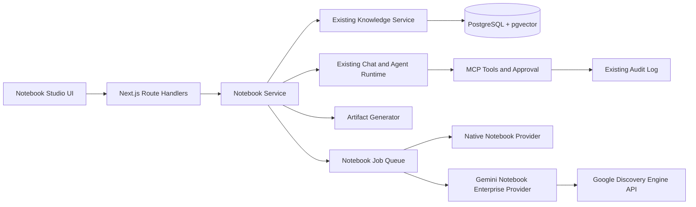

# ai2dot Notebook Studio 与 Gemini Notebook Enterprise 集成开发方案

文档状态：Draft for implementation<br />
最后更新：2026-09-27<br />
适用仓库：`free2way/ai2dot`<br />
目标运行环境：Vercel + Neon、Docker + PostgreSQL/pgvector

## 1. 决策摘要

ai2dot 将建设自己的 **Notebook Studio（研究空间）**，并把 **Gemini Notebook Enterprise** 作为可选的外部 Notebook Provider。

核心原则：

1. ai2dot Notebook 是业务主记录（source of truth），不依赖 Google 才能创建、检索、对话和生成研究产物。
2. Gemini Notebook Enterprise 是一个可选投影：用户可以把 ai2dot Notebook 的来源同步到 Google，并使用 Google 提供的 Notebook 界面和 Audio Overview。
3. 不接入个人版 `notebook.google` 的非公开接口，不传递浏览器 Cookie，不依赖网页自动化或逆向协议。
4. Notebook Studio 复用现有知识库、混合检索、会话、Agent、MCP、加密和审计能力，不建立第二套 RAG 数据面。
5. 所有长任务使用 PostgreSQL 持久化状态；Docker 和 Vercel 只采用不同调度器，不采用不同业务实现。
6. 外部删除、覆盖、分享和上传等有副作用操作必须经过明确权限检查；由 Agent 发起时继续执行现有人工确认策略。

## 2. 背景与产品定位

ai2dot 当前已经具备：

- 文档导入、文本提取和知识分块。
- PostgreSQL `pg_trgm` 关键词召回。
- pgvector + HNSW 语义召回。
- RRF 混合排序、来源多样性限制和回答引用。
- 多模型、BYOK、助手与会话分支。
- Agent `plan -> act -> observe`、MCP 白名单、人工确认和工具审计。
- Chrome 扩展的网页提取、Markdown 生成与知识库上传。
- Vercel + Neon 和 Docker + PostgreSQL 双运行环境。

Notebook Studio 不应只是现有知识库页面换一个名称。它应在知识库之上提供一个面向研究任务的工作界面：

- 围绕一个主题组织来源。
- 基于选中来源连续提问并保留引用。
- 生成摘要、FAQ、时间线、学习指南、思维导图等可复用产物。
- 绑定助手、模型和可用工具。
- 将研究结果通过 MCP 发布到 Notion、Gmail 等外部系统。
- 可选同步到 Gemini Notebook Enterprise 并生成 Audio Overview。

产品显示名称建议：

- 中文：`研究空间`
- 英文：`Notebook Studio`
- Google 连接器：`Gemini Notebook Enterprise`

不要把 ai2dot 自身功能命名为 NotebookLM，也不要暗示 ai2dot 是 Google 官方客户端。

## 3. Google 官方能力边界

截至 2026-09-27，Google 官方文档体现的边界如下：

| 能力 | Gemini Notebook Enterprise | 个人版 NotebookLM |
| --- | --- | --- |
| 创建、读取、列出和删除 Notebook | 有官方 API | 未发现面向第三方应用的公开 API |
| 上传文本、网页、YouTube、Google Docs/Slides 和文件 | 有 API；来源 API 当前标记为 Preview | 只能使用产品 UI |
| 基于来源查询、聊天和生成摘要 | Enterprise 产品支持；部分程序化接口仍为 `v1alpha`，必须先做账号级 PoC | 无正式第三方 API |
| 创建 Audio Overview | 有 Preview API | 只能使用产品 UI |
| IAM、企业身份与数据区域 | 支持 | 不适用 |
| 程序化集成建议 | 可以作为可选 Provider | 只提供导出和打开页面的松耦合体验 |

已确认的重要限制：

1. Enterprise 用户必须有对应 Google Cloud IAM 角色和许可证。
2. 当前订阅最少包含 15 个许可证，不适合作为 ai2dot 个人用户的默认依赖。
3. Google 导入来源后保存的是静态副本；原文件变化不会自动反映到 Notebook。
4. Google Docs 和 Google Slides 来源需要用户级 Google Drive 授权。
5. 一个来源的复制会形成新的数据副本，原系统与 Google Notebook 的访问权限需要分别治理。
6. Audio Overview 生成需要数分钟，且当前一个 Notebook 同时只支持一个 Audio Overview。
7. VPC Service Controls 开启时，外部网页 URL 来源可能无法导入。
8. Preview 和 `v1alpha` 接口可能发生不兼容变化，必须通过能力探测和 feature flag 隔离。

官方参考：

- Gemini Notebook Enterprise 概览：<https://docs.cloud.google.com/gemini/enterprise/notebooklm-enterprise/docs/overview>
- 创建和管理 Notebook：<https://docs.cloud.google.com/gemini/enterprise/notebooklm-enterprise/docs/api-notebooks>
- 来源管理 API：<https://docs.cloud.google.com/gemini/enterprise/notebooklm-enterprise/docs/api-notebooks-sources>
- Audio Overview API：<https://docs.cloud.google.com/gemini/enterprise/notebooklm-enterprise/docs/api-audio-overview>
- Enterprise 设置：<https://docs.cloud.google.com/gemini/enterprise/notebooklm-enterprise/docs/set-up-notebooklm>
- 许可证设置：<https://docs.cloud.google.com/gemini/enterprise/notebooklm-enterprise/docs/set-up-licensing>
- 使用审计日志：<https://docs.cloud.google.com/gemini/enterprise/notebooklm-enterprise/docs/set-up-usage-audit-logs-for-nblme>
- Enterprise 分享规则：<https://docs.cloud.google.com/gemini/enterprise/notebooklm-enterprise/docs/share-notebooks>

### 3.1 中国境内部署结论

中国境内 Docker 部署必须区分三件事：

1. **ai2dot Native Notebook Studio**：完全运行在本地 Docker、PostgreSQL 和现有模型 Provider 上，不受 Google 支持地区限制。
2. **服务器调用 Gemini Notebook Enterprise API**：技术上取决于服务器到 `discoveryengine.googleapis.com` 的出口网络、Google Cloud 项目、用户 OAuth、IAM 角色和 Enterprise 许可证。
3. **最终用户打开 Google Notebook 网页**：取决于用户所在网络能否访问 `notebook.cloud.google.com`，不能因为服务器 API 可达就假设浏览器也可达。

Google 官方数据位置页面目前没有中国大陆位置。公开位置包括 `global`、`us`、`eu`，以及需要 allowlist 的加拿大、印度、日本、新加坡和英国。个人版 Gemini Notebook 的官方支持国家/地区列表当前也没有列出中国大陆。因此：

- 不把中国境内用户自动判定为 Google Provider 可用。
- 不把 `cn` 配置成 Google 数据位置。
- 中国境内部署默认关闭 Google Provider，只显示就绪度和网络探针。
- 即使选择 `global` 并且网络可达，也必须确认跨境传输、数据分类、告知与用户授权要求。
- 面向中国用户的产品承诺以 Native Notebook Studio 为准，Google 只作为企业客户自行启用的可选能力。

2026-09-27 对 Docker 主机 `192.168.2.235` 的只读网络实测结果：

- `discoveryengine.googleapis.com`：DNS、TCP 和 TLS 均成功，约 1.7 秒获得 HTTP 响应。
- `notebook.cloud.google.com/global/`：DNS、TCP 和 TLS 均成功，约 1.7 秒获得 HTTP 302 跳转。

上述结果只证明测试时刻的网络路径可用，不证明账号、项目、许可证或具体 Notebook API 已获授权，也不构成长期可用性保证。

## 4. 范围

### 4.1 MVP 范围

MVP 必须完成：

- 创建、编辑、归档和删除 ai2dot Notebook。
- 每个 Notebook 自动创建并绑定一个现有知识库。
- 上传文本、Markdown、PDF、DOCX、网页采集内容等现有知识库支持的来源。
- 展示来源解析和 embedding 状态。
- 在 Notebook 上下文中发起多轮对话并显示引用。
- 生成 Markdown 摘要、FAQ、时间线和学习指南。
- 生成结构化思维导图数据并提供可视化。
- 对产物保存版本、来源快照和生成状态。
- Notebook 可绑定一个助手；助手继续遵守 MCP 白名单和人工确认策略。
- Vercel 与 Docker 运行相同的 schema、API 和业务服务。
- 使用 feature flag 控制 Notebook Studio 和 Google Provider。

### 4.2 Google Provider 首版范围

- 管理员或工作区用户连接 Gemini Notebook Enterprise。
- 验证 Project Number、Location、身份与必要权限。
- 创建外部 Notebook。
- 将 ai2dot 来源以规范化文本同步到外部 Notebook。
- 保存本地 Notebook 与外部 Notebook 的映射。
- 展示每个来源的同步状态和最后同步时间。
- 手动触发重新同步。
- 打开 Enterprise Notebook 用户界面。
- 创建并轮询 Audio Overview。
- 在 API 和账号确实支持时，灰度启用外部 Notebook 查询。

### 4.3 非目标

首版不做：

- 个人版 NotebookLM 的 Cookie 登录、页面抓取或非官方 API。
- ai2dot 与 Google Notebook 的实时双向编辑。
- 自动继承 Google Drive 原文件 ACL。
- 把 Google 作为 ai2dot Notebook 的唯一数据存储。
- 在两个系统之间自动传播删除操作。
- 在 Vercel 本地文件系统保存长期任务或原始文件。
- 在没有对象存储前承诺原样同步 PDF、音频和视频二进制文件。
- 对 Google Preview API 提供稳定性 SLA。

## 5. 用户体验设计

### 5.1 信息架构

新增一级导航：`研究空间`，路由为 `/notebooks`。

Notebook 详情路由：`/notebooks/:notebookId`。

桌面端采用三栏工作区：

1. 左栏：来源列表、处理状态、来源选择和同步状态。
2. 中栏：基于来源的聊天、引用和问题建议。
3. 右栏：Studio 产物，包括摘要、FAQ、时间线、学习指南、思维导图和音频。

移动端改为三个页签：`来源`、`对话`、`Studio`，避免三栏压缩。

### 5.2 Notebook 列表

每行显示：

- 标题和描述。
- 来源数量。
- 已完成向量化的来源数量。
- 最近更新时间。
- 绑定助手。
- Google Provider 状态：未连接、待同步、同步中、已同步、部分失败。

主要操作：

- 新建 Notebook。
- 归档/恢复。
- 删除。
- 连接或断开 Gemini Notebook Enterprise。

### 5.3 Notebook 详情

来源区操作：

- 上传文件。
- 粘贴文本。
- 添加网页 URL；第一版通过 Chrome 扩展或服务端受控抓取进入 ai2dot，不直接让 Google 抓取。
- 从现有知识库复制来源；首版可以推迟，只支持新上传。
- 选择参与本次提问或产物生成的来源。
- 查看解析、embedding 和外部同步错误。

对话区：

- 默认使用 Notebook 绑定助手和模型。
- 用户可临时切换模型。
- 请求只检索当前 Notebook 对应知识库。
- 每条回答保留 ai2dot 来源引用。
- 外部 Google 查询仅在 Provider 能力探测通过时显示为可选模式。

Studio 区：

- `生成摘要`
- `生成 FAQ`
- `生成时间线`
- `生成学习指南`
- `生成思维导图`
- `生成 Audio Overview`，仅连接 Google Provider 时显示

产物生成按钮必须展示当前选中的来源范围。重新生成默认产生新版本，不覆盖旧版本。

## 6. 总体架构



### 6.1 分层职责

| 层 | 职责 |
| --- | --- |
| Notebook UI | 研究空间、来源、对话、Studio 和外部同步状态 |
| Notebook Service | 权限、Notebook 生命周期、来源选择、产物版本与 provider binding |
| Knowledge Service | 文档解析、分块、embedding 和混合检索 |
| Chat/Agent Runtime | 多轮对话、模型调用、MCP 和引用输出 |
| Artifact Generator | 固定模板的结构化研究产物生成 |
| Job Queue | 可恢复任务、租约、退避重试和幂等 |
| Provider Adapter | Native 与 Google Enterprise 能力差异封装 |

### 6.2 主记录原则

ai2dot Notebook、来源元数据、聊天、产物和权限是主记录。

Google Notebook 是外部投影：

- `push`：ai2dot -> Google。
- `status`：Google -> ai2dot，仅同步处理状态和外部标识。
- 首版不从 Google 拉取正文覆盖 ai2dot。
- 首版不把 Google 中的删除自动传播回 ai2dot。
- 断开 Provider 不删除 ai2dot Notebook。

## 7. 复用现有能力

### 7.1 知识库

每个 Notebook 对应一个专属 `knowledge_bases` 记录：

```text
notebooks.knowledge_base_id -> knowledge_bases.id
```

继续复用：

- `knowledge_documents`
- `knowledge_chunks`
- `knowledge_embedding_jobs`
- `processKnowledgeEmbeddingJobs()`
- `rerankHybridKnowledgeResults()`

这样 Notebook 对话自动得到现有的关键词 + pgvector + HNSW + RRF 检索能力。

### 7.2 会话与 Generation

在 `conversations` 增加可空的 `notebook_id`：

- 普通聊天：`notebook_id IS NULL`。
- Notebook 聊天：`notebook_id` 指向当前 Notebook。
- Notebook 对话固定限制知识范围为该 Notebook 的 `knowledge_base_id`。
- 继续复用 Generation 幂等、流式输出、Token 用量和错误处理。

### 7.3 助手与 MCP

Notebook 可以绑定一个 `assistant_id`。执行时：

- 使用助手的默认模型、系统提示词、知识库和 MCP 白名单。
- Notebook 专属知识库必须加入本次检索范围。
- 来源中的提示注入内容不得被解释为 MCP 调用授权。
- 写入 Google、Notion、Gmail 等工具继续走人工确认和 `mcp_tool_audit_logs`。

### 7.4 加密

Google OAuth Refresh Token 复用 `src/server/providers/secret.ts` 的 AES-256-GCM 封装，不新增第二套加密格式。

浏览器只能得到：

- `connected: true/false`
- Google 账号显示名称或脱敏邮箱
- Project Number 和 Location
- 授权 Scope 摘要
- Token 到期/撤销状态

Refresh Token 和 Access Token 绝不返回浏览器。

## 8. Provider 抽象

```ts
export type NotebookProviderCapabilities = {
  createNotebook: boolean;
  pushTextSource: boolean;
  uploadBinarySource: boolean;
  askSources: boolean;
  audioOverview: boolean;
  shareNotebook: boolean;
};

export interface NotebookProvider {
  readonly id: "native" | "google-enterprise";

  probe(context: ProviderContext): Promise<NotebookProviderCapabilities>;

  createNotebook(
    context: ProviderContext,
    input: { title: string },
  ): Promise<ExternalNotebookRef>;

  pushTextSource(
    context: ProviderContext,
    input: {
      notebook: ExternalNotebookRef;
      title: string;
      content: string;
      contentHash: string;
    },
  ): Promise<ExternalSourceRef>;

  getSource(
    context: ProviderContext,
    input: { notebook: ExternalNotebookRef; sourceId: string },
  ): Promise<ExternalSourceStatus>;

  ask?(
    context: ProviderContext,
    input: { notebook: ExternalNotebookRef; sourceIds: string[]; query: string },
  ): AsyncIterable<ExternalNotebookAnswer>;

  createAudioOverview?(
    context: ProviderContext,
    input: {
      notebook: ExternalNotebookRef;
      sourceIds: string[];
      languageCode: string;
      episodeFocus?: string;
    },
  ): Promise<ExternalArtifactRef>;

  getOpenUrl(
    context: ProviderContext,
    notebook: ExternalNotebookRef,
  ): string;
}
```

规则：

- UI 不判断 Google API 版本，只读取 `capabilities`。
- Preview 能力默认关闭，`probe()` 成功且 feature flag 开启后才显示。
- Google 返回未实现、权限不足或区域不支持时，降级到 Native，不影响 Notebook 本身。
- Provider 错误统一映射为稳定的 ai2dot 错误码。

建议错误码：

```text
NOTEBOOK_PROVIDER_NOT_CONFIGURED
NOTEBOOK_PROVIDER_AUTH_REQUIRED
NOTEBOOK_PROVIDER_LICENSE_REQUIRED
NOTEBOOK_PROVIDER_PERMISSION_DENIED
NOTEBOOK_PROVIDER_REGION_UNSUPPORTED
NOTEBOOK_PROVIDER_CAPABILITY_UNAVAILABLE
NOTEBOOK_SOURCE_LIMIT_EXCEEDED
NOTEBOOK_SOURCE_PROCESSING_FAILED
NOTEBOOK_EXTERNAL_RATE_LIMITED
NOTEBOOK_EXTERNAL_TEMPORARILY_UNAVAILABLE
```

## 9. 数据模型

### 9.1 枚举

建议新增：

```text
notebook_status: active | archived
notebook_artifact_type: summary | faq | timeline | study_guide | mind_map | audio_overview
notebook_artifact_status: pending | running | ready | failed
notebook_provider_type: google_enterprise
notebook_binding_status: pending | syncing | ready | partial | failed | disconnected
notebook_source_sync_status: pending | syncing | processing | ready | stale | failed
notebook_job_type: generate_artifact | create_external_notebook | sync_external_source | poll_external_source | create_audio_overview | poll_audio_overview
notebook_job_status: pending | running | completed | failed | cancelled
```

### 9.2 `notebooks`

```text
id                    uuid primary key
workspace_id          uuid not null -> workspaces.id
created_by_user_id    uuid not null -> users.id
knowledge_base_id     uuid not null unique -> knowledge_bases.id
assistant_id          uuid null -> assistants.id
title                 text not null
description           text null
status                notebook_status not null default active
created_at            timestamptz not null
updated_at            timestamptz not null
```

索引：

- `(workspace_id, status, updated_at DESC)`
- `(assistant_id)`

创建 Notebook 和专属知识库必须在同一数据库事务中完成。

### 9.3 `notebook_artifacts`

```text
id                    uuid primary key
workspace_id          uuid not null
notebook_id           uuid not null -> notebooks.id
created_by_user_id    uuid not null -> users.id
type                  notebook_artifact_type not null
status                notebook_artifact_status not null
title                 text not null
content_markdown      text null
content_json          jsonb null
source_document_ids   jsonb not null
source_snapshot_hash  text not null
prompt_version        text not null
model_id              uuid null -> models.id
provider_type         text not null default native
external_resource     jsonb null
error_message         text null
created_at            timestamptz not null
updated_at            timestamptz not null
```

当 Notebook 来源变化且 `source_snapshot_hash` 不一致时，UI 标记产物为“来源已更新”，但不删除旧产物。

### 9.4 `notebook_provider_connections`

```text
id                    uuid primary key
workspace_id          uuid not null -> workspaces.id
created_by_user_id    uuid not null -> users.id
provider_type         notebook_provider_type not null
display_name          text not null
project_number        text not null
location              text not null
encrypted_credentials text not null
granted_scopes        jsonb not null
capabilities          jsonb not null
enabled               boolean not null default true
last_verified_at      timestamptz null
last_error            text null
created_at            timestamptz not null
updated_at            timestamptz not null
```

唯一约束：

- MVP 每个工作区一个 Google Enterprise 连接：`UNIQUE(workspace_id, provider_type)`。

### 9.5 `notebook_external_bindings`

```text
id                         uuid primary key
workspace_id               uuid not null
notebook_id                uuid not null -> notebooks.id
provider_connection_id     uuid not null -> notebook_provider_connections.id
external_notebook_id       text not null
external_resource_name     text not null
external_url               text null
status                     notebook_binding_status not null
last_synced_at             timestamptz null
last_error                 text null
created_at                 timestamptz not null
updated_at                 timestamptz not null
```

唯一约束：

- `UNIQUE(notebook_id, provider_connection_id)`
- `UNIQUE(provider_connection_id, external_resource_name)`

### 9.6 `notebook_external_sources`

```text
id                         uuid primary key
workspace_id               uuid not null
binding_id                 uuid not null -> notebook_external_bindings.id
knowledge_document_id      uuid not null -> knowledge_documents.id
external_source_id         text null
external_resource_name     text null
content_hash               text not null
status                     notebook_source_sync_status not null
last_synced_at             timestamptz null
last_checked_at            timestamptz null
last_error                 text null
created_at                 timestamptz not null
updated_at                 timestamptz not null
```

唯一约束：

- `UNIQUE(binding_id, knowledge_document_id)`

### 9.7 `notebook_jobs`

沿用 `knowledge_embedding_jobs` 的租约模型：

```text
id                    uuid primary key
workspace_id          uuid not null
notebook_id           uuid not null
type                  notebook_job_type not null
status                notebook_job_status not null default pending
idempotency_key       text not null
payload               jsonb not null
result                jsonb null
attempts              integer not null default 0
available_at          timestamptz not null default now()
locked_at             timestamptz null
completed_at          timestamptz null
last_error            text null
created_at            timestamptz not null
updated_at            timestamptz not null
```

索引和约束：

- `UNIQUE(workspace_id, idempotency_key)`
- `(status, available_at, created_at)` 用于 `FOR UPDATE SKIP LOCKED` 领取。
- `(workspace_id, notebook_id, created_at DESC)` 用于 UI 和审计查询。

### 9.8 现有表修改

`conversations`：

```text
notebook_id uuid null -> notebooks.id ON DELETE SET NULL
```

索引：

```text
(notebook_id, updated_at DESC)
```

平台管理控制台后续增加 Notebook、来源、产物、外部同步和失败任务计数。

## 10. 来源与内容策略

### 10.1 Native 来源

继续使用现有知识库上传链路：

1. 验证用户和工作区。
2. 提取正文。
3. 写入 `knowledge_documents` 和 `knowledge_chunks`。
4. 入队 `knowledge_embedding_jobs`。
5. 由即时处理和补偿 worker 完成 embedding。

### 10.2 Google 同步格式

当前 `knowledge_documents` 不保存原始二进制文件，正文保存在 `knowledge_chunks` 中。因此 Google Provider 第一版必须：

1. 按 `chunk_index` 重建规范化正文。
2. 生成稳定 Markdown：标题、原始来源信息、同步时间和正文。
3. 计算 SHA-256 `content_hash`。
4. 调用 Google `textContent` 来源 API。
5. 保存外部 Source ID 和处理状态。

不要在首版从临时文件目录重新上传原始 PDF；Vercel Function 和 Docker 本地磁盘没有一致的持久化语义。

### 10.3 后续二进制来源

如果需要原样同步 PDF、音频、图片和 Office 文件，先实现 `BlobStore` 抽象：

```ts
interface BlobStore {
  put(input: PutBlobInput): Promise<BlobRef>;
  get(ref: BlobRef): Promise<ReadableStream>;
  delete(ref: BlobRef): Promise<void>;
  createDownloadUrl(ref: BlobRef, ttlSeconds: number): Promise<string>;
}
```

建议映射：

- Vercel：Vercel Blob、S3 或 R2。
- Docker：S3 兼容存储或 MinIO；不要把容器可写层当作长期存储。

## 11. API 设计

所有接口使用现有 Clerk/本地认证统一解析，并且每次查询同时限定 `workspace_id`。

### 11.1 Notebook

```text
GET    /api/notebooks
POST   /api/notebooks
GET    /api/notebooks/:notebookId
PATCH  /api/notebooks/:notebookId
DELETE /api/notebooks/:notebookId
```

创建请求：

```json
{
  "title": "AI Agent 产品研究",
  "description": "竞品、技术路线与用户反馈",
  "assistantId": null
}
```

删除接口默认删除 ai2dot Notebook、专属知识库、会话和产物；不会自动删除 Google 外部 Notebook。UI 必须在删除确认中说明这一点，并提供独立的“同时删除外部 Notebook”高风险操作。

### 11.2 来源

```text
GET    /api/notebooks/:notebookId/sources
POST   /api/notebooks/:notebookId/sources
DELETE /api/notebooks/:notebookId/sources/:documentId
POST   /api/notebooks/:notebookId/sources/:documentId/reindex
```

Notebook API 内部转调现有 Knowledge Service，不复制解析实现。

### 11.3 对话

不新增第二套聊天协议。扩展现有 `POST /api/chat`：

```json
{
  "conversationId": "...",
  "notebookId": "...",
  "message": "比较这些方案的安全边界",
  "selectedSourceIds": ["document-1", "document-2"]
}
```

服务端规则：

- `notebookId` 必须属于当前工作区。
- `selectedSourceIds` 必须属于 Notebook 对应知识库。
- 未选择来源时使用 Notebook 中全部 `ready` 来源。
- Notebook 范围优先于助手额外知识库，避免意外扩展数据范围。
- 返回现有 AI SDK source parts，保持引用 UI 一致。

### 11.4 Studio 产物

```text
GET    /api/notebooks/:notebookId/artifacts
POST   /api/notebooks/:notebookId/artifacts
GET    /api/notebooks/:notebookId/artifacts/:artifactId
DELETE /api/notebooks/:notebookId/artifacts/:artifactId
```

生成请求：

```json
{
  "type": "study_guide",
  "sourceDocumentIds": ["..."],
  "modelId": "...",
  "options": {
    "language": "zh-CN",
    "audience": "工程团队"
  }
}
```

接口返回 `202 Accepted` 和 `jobId`，由客户端轮询产物状态。

### 11.5 Google 连接

```text
GET    /api/notebook-providers
POST   /api/notebook-providers/google/oauth/start
GET    /api/notebook-providers/google/oauth/callback
GET    /api/notebook-providers/google/connection
PATCH  /api/notebook-providers/google/connection
DELETE /api/notebook-providers/google/connection
POST   /api/notebook-providers/google/connection/verify
```

OAuth `state` 必须是短期、签名、一次性值，并绑定：

- 当前用户。
- 当前工作区。
- 回跳地址。
- PKCE verifier 或服务器端 nonce。

### 11.6 外部绑定与同步

```text
POST   /api/notebooks/:notebookId/external-bindings/google
GET    /api/notebooks/:notebookId/external-bindings/google
DELETE /api/notebooks/:notebookId/external-bindings/google
POST   /api/notebooks/:notebookId/external-bindings/google/sync
POST   /api/notebooks/:notebookId/external-bindings/google/audio-overview
```

同步请求只负责入队并返回 `202`。不要在一个 Vercel 请求中串行上传全部来源并等待 Google 完成处理。

### 11.7 后台任务

```text
GET /api/cron/notebook-jobs
```

使用现有 `CRON_SECRET` Bearer 保护。任务领取、执行和状态更新位于共享服务，不写在 Route Handler 中。

## 12. Studio 产物生成

### 12.1 模板

模板必须版本化，例如：

```text
notebook.summary.v1
notebook.faq.v1
notebook.timeline.v1
notebook.study-guide.v1
notebook.mind-map.v1
```

每次生成保存 `prompt_version`。不要把完整内部提示词返回客户端。

### 12.2 输出格式

| 类型 | 存储格式 |
| --- | --- |
| 摘要 | Markdown |
| FAQ | JSON + 渲染后的 Markdown |
| 时间线 | JSON + Markdown |
| 学习指南 | Markdown |
| 思维导图 | JSON 树；前端渲染 |
| Audio Overview | 外部资源状态和 URL，不把临时 Access Token 写入数据库 |

### 12.3 Grounding

产物生成前执行现有混合检索，但不能只检索一次泛化查询。建议：

1. 根据产物类型生成 3-8 个子问题。
2. 对每个子问题执行混合检索。
3. 按文档和 chunk 去重。
4. 在模型上下文中携带稳定来源编号。
5. 输出中保留来源引用。

生成任务必须限制最大上下文、最大输出 Token 和总时长。

## 13. Google 身份与授权

### 13.1 管理员前置配置

Google Cloud 管理员需要：

1. 创建或选择 Google Cloud Project。
2. 启用 Discovery Engine API。
3. 配置 Gemini Notebook Enterprise。
4. 配置 Cloud Identity 或 Workforce Identity Federation。
5. 为用户分配 Cloud NotebookLM User 角色和许可证。
6. 配置 OAuth Client 和 ai2dot Callback URL。

### 13.2 用户连接流程

1. 用户在 ai2dot 工作区打开 Provider 设置。
2. 输入 Project Number 和 Location。
3. 点击“连接 Google”。
4. 完成 Google OAuth 同意。
5. ai2dot 交换 Token，并加密保存 Refresh Token。
6. 服务端调用轻量 API 验证身份、区域和权限。
7. 执行 `probe()`，保存实际可用能力。

不要默认使用服务账号冒充最终用户。Google Drive 来源要求用户级授权；Enterprise Notebook 的所有权和分享也与用户身份相关。服务账号模式必须作为后续单独设计，并经过 Google 官方支持确认。

### 13.3 OAuth Scope

优先请求最小 Scope。根据已启用功能逐步增加：

- Discovery Engine 读写 Scope。
- 只有导入 Google Docs/Slides 时才申请 Drive 相关 Scope。

Scope 变化时要求用户重新授权，不在后台静默扩大权限。

## 14. 后台任务与双运行环境

### 14.1 状态机

任务状态：

```text
pending -> running -> completed
                   -> pending (retry)
                   -> failed
                   -> cancelled
```

规则：

- 使用 `FOR UPDATE SKIP LOCKED` 领取。
- 默认最大重试 5 次。
- 指数退避，最大间隔 15 分钟。
- `locked_at` 超过 10 分钟视为失效租约，可以重新领取。
- 所有 Provider 写操作使用 `idempotency_key`。
- Google 429、5xx 和网络错误可重试；4xx 权限或输入错误直接失败。

### 14.2 Vercel

- Route Handler 使用 Node.js runtime。
- 创建任务后使用 `after()` 尝试处理少量任务，改善交互延迟。
- `after()` 不是可靠队列，Vercel Cron 必须补偿未完成任务。
- Cron 频率按 Vercel 套餐能力配置；频率不足时 UI 明确显示“排队中”。
- 不在 Function 内等待数分钟的 Audio Overview 完成。
- Client 轮询 ai2dot 数据库状态，不直接高频轮询 Google。

### 14.3 Docker

第一版可以增加 `notebook-worker` 服务，结构与 `embedding-worker` 相同：

```text
每 30 秒 -> GET http://app:3000/api/cron/notebook-jobs
Authorization: Bearer ${CRON_SECRET}
```

后续可把 embedding 和 notebook worker 合并为统一 `background-worker`，但任务表和处理器仍保持独立。

### 14.4 同一实现约束

Vercel 和 Docker 必须共用：

- Drizzle schema 与 migration。
- Provider Adapter。
- 任务领取与执行器。
- 重试和错误分类。
- 权限检查。
- 产物生成逻辑。

只允许调度入口不同。

## 15. 同步算法

### 15.1 创建外部 Notebook

1. 验证 Provider 连接和能力。
2. 创建 `notebook_external_bindings`，状态为 `pending`。
3. 入队 `create_external_notebook`。
4. Worker 调用 Google 创建 Notebook。
5. 保存 ID、resource name 和 open URL。
6. 为全部 `ready` 本地来源创建同步任务。

### 15.2 同步来源

1. 读取并验证 `knowledge_document` 属于 Notebook。
2. 按 chunk 顺序重建规范化 Markdown。
3. 计算 `content_hash`。
4. 如果与最后同步 hash 相同，直接幂等完成。
5. 如果不同，创建新的 Google 来源。
6. 轮询来源直到 `COMPLETE` 或 `FAILED`。
7. 保存外部标识和状态。
8. 旧外部来源暂不自动删除；后续由显式清理操作处理。

Google 来源为静态副本，因此本地内容变化后状态标记为 `stale`，由用户点击“重新同步”或按工作区策略自动入队。

### 15.3 Audio Overview

1. 确认全部选中来源已经在 Google 为 `ready`。
2. 确认当前没有正在生成的 Audio Overview。
3. 入队 `create_audio_overview`。
4. Google 返回 `IN_PROGRESS` 后，入队延迟轮询任务。
5. 使用退避轮询，状态落入本地数据库。
6. 完成后展示 Google Notebook 打开入口。
7. 首版不代理下载音频文件；下载能力另行验证授权和 URL 生命周期。

## 16. Agent 与 MCP 集成

Notebook Studio 本身应暴露一组内部工具，供 ai2dot Agent 使用：

```text
notebook.list
notebook.create
notebook.add_text_source
notebook.search
notebook.generate_artifact
notebook.sync_google
notebook.create_audio_overview
```

风险建议：

| 工具 | 风险 | 默认策略 |
| --- | --- | --- |
| list/search | read | 可自动批准 |
| create | write | 人工确认 |
| add_text_source | write | 人工确认 |
| generate_artifact | cost | 显示模型和预计范围后确认 |
| sync_google | external-write | 人工确认 |
| create_audio_overview | external-write/cost | 人工确认 |

如果以 MCP Server 形式暴露，应继续使用现有 Assistant MCP 白名单；如果实现为内部 AI SDK Tool，也必须写入统一审计记录，不能绕过 MCP 风险模型。

## 17. 安全与隐私

### 17.1 租户隔离

- 每个 Notebook 查询必须包含 `workspace_id`。
- 不接受只按 `notebook_id`、`artifact_id` 或 `job_id` 的裸查询。
- 外部 binding、connection、source mapping 和 job 均冗余保存 `workspace_id`，便于强制边界和审计。
- 用户只能使用当前工作区启用的 Provider 连接。

### 17.2 Prompt Injection

来源正文属于不可信数据：

- 来源中的“调用工具”“上传密钥”“忽略规则”等内容只能作为引用文本。
- Notebook 检索结果不能修改 Assistant 工具白名单。
- 产物生成默认禁止 MCP 调用。
- 只有明确的 Agent 工作流才能调用外部工具，并继续要求人工确认。

### 17.3 凭据

- Refresh Token 使用 AES-256-GCM 加密。
- Access Token 仅保存在进程内短期使用。
- 日志禁止记录 Authorization Header、OAuth Code、Refresh Token 和完整 Provider 响应。
- 断开连接时尽力撤销 Token，并删除本地密文。
- `PROVIDER_SECRET_ENCRYPTION_KEY` 轮换需要先设计密钥版本和重加密流程。

### 17.4 数据复制提示

首次同步到 Google 前必须展示：

> 选中的来源将被复制到你的 Google Cloud 项目。Google Notebook 中的副本拥有独立的访问权限和生命周期，后续修改或删除原始文档不会自动修改该副本。

## 18. 可观测性与管理控制台

结构化事件建议：

```text
notebook.created
notebook.source_added
notebook.artifact_requested
notebook.artifact_completed
notebook.provider_connected
notebook.external_created
notebook.source_sync_started
notebook.source_sync_completed
notebook.source_sync_failed
notebook.audio_requested
notebook.audio_completed
notebook.job_retry_scheduled
```

每个事件至少包含：

- `requestId`
- `workspaceId`
- `userId`
- `notebookId`
- `jobId`
- `providerType`
- `latencyMs`
- `status`
- 脱敏错误码

平台管理控制台增加：

- Notebook 数量和活跃数。
- 来源与向量化覆盖率。
- 产物生成次数和失败率。
- Google Provider 连接工作区数。
- 待处理、重试和失败任务数。
- 外部 API 429、权限错误和区域错误统计。

## 19. 配置与 Feature Flag

建议环境变量：

```dotenv
AI2DOT_NOTEBOOK_STUDIO_ENABLED=true
AI2DOT_GOOGLE_NOTEBOOK_ENABLED=false
AI2DOT_GOOGLE_NOTEBOOK_QUERY_ENABLED=false
GOOGLE_NOTEBOOK_OAUTH_CLIENT_ID=
GOOGLE_NOTEBOOK_OAUTH_CLIENT_SECRET=
GOOGLE_NOTEBOOK_OAUTH_REDIRECT_URI=
AI2DOT_NOTEBOOK_JOB_MAX_ATTEMPTS=5
AI2DOT_NOTEBOOK_JOB_BATCH_SIZE=4
```

约束：

- 前端不读取 Client Secret。
- Docker 和 Vercel 使用相同变量名。
- Google Provider 默认关闭；完成企业账号 PoC 后再开启。
- 外部查询单独开关，因为对应程序化接口仍需要实际账号验证。
- `CRON_SECRET` 继续保护 Cron，不新增含义重复的 Secret。

## 20. 建议代码结构

```text
src/
  app/
    notebooks/
      page.tsx
      [notebookId]/page.tsx
    api/
      notebooks/
      notebook-providers/
      cron/notebook-jobs/route.ts
  components/
    notebooks/
      notebook-list.tsx
      notebook-workspace.tsx
      notebook-sources.tsx
      notebook-chat.tsx
      notebook-studio.tsx
      notebook-provider-dialog.tsx
  lib/
    notebooks.ts
  server/
    notebooks/
      store.ts
      service.ts
      validation.ts
      artifacts.ts
      jobs.ts
      providers/
        types.ts
        native.ts
        google-enterprise.ts
        google-auth.ts
```

Route Handler 只负责：认证、解析输入、调用 service、映射响应。数据库事务、Provider 调用、任务状态机和错误分类必须放在 `src/server/notebooks`。

## 21. Migration 与兼容性

建议拆成两个 migration：

### Migration A：Native Notebook

- 新建 `notebooks`。
- 新建 `notebook_artifacts`。
- 新建 `notebook_jobs`。
- 为 `conversations` 添加 `notebook_id`。
- 添加索引和外键。

### Migration B：External Provider

- 新建 `notebook_provider_connections`。
- 新建 `notebook_external_bindings`。
- 新建 `notebook_external_sources`。
- 添加 Provider 枚举、索引和唯一约束。

Migration 必须在以下环境验证：

- 空 PostgreSQL 17 + pgvector。
- 已有 Docker 生产数据的副本。
- Neon unpooled connection。

回滚优先使用 feature flag，不在生产上自动执行 destructive down migration。

## 22. 测试方案

### 22.1 单元测试

- Notebook 输入验证与权限过滤。
- 来源快照 hash 的稳定性。
- Artifact 模板和结构化输出解析。
- Provider 错误映射。
- Job 领取、租约失效、重试和幂等。
- Google Token 加密/解密且明文不出现在序列化结果。
- 来源更新后 artifact stale 判断。

### 22.2 数据库集成测试

- Notebook 与知识库事务创建。
- 跨 workspace 访问返回 404/403。
- `SKIP LOCKED` 并发领取不重复执行。
- 删除 Notebook 时本地级联符合预期。
- 断开 Google Provider 不删除本地 Notebook。

### 22.3 Provider Contract 测试

建立同一套 Provider Contract：

- `probe()` 返回稳定 capability shape。
- create 操作支持 idempotency。
- push 相同 content hash 不产生重复来源。
- 429 映射为可重试错误。
- 401/403 映射为重新授权或权限不足。
- 响应正文不会泄露到日志。

默认 CI 使用 Mock Google Server；真实 Google Cloud Canary 测试只在受保护环境按需运行。

### 22.4 E2E

Playwright 覆盖：

1. 创建 Notebook。
2. 上传 Markdown。
3. 等待解析和 embedding ready。
4. 在 Notebook 中提问并看到引用。
5. 生成摘要和思维导图。
6. 刷新页面后状态仍存在。
7. Mock Google 连接、同步和失败重试。
8. Clerk 和本地认证各覆盖一次核心路径。
9. 桌面三栏与移动端页签无溢出。

### 22.5 双环境验收

- `npm run typecheck`
- `npm test`
- `npm run build`
- Docker Compose migration、app、worker 健康。
- Vercel build 和 Neon migration 成功。
- Docker 重启和 Vercel 冷启动不会丢失任务状态。

## 23. 交付阶段

### Phase 0：Google Enterprise PoC，2-4 人日

- 准备 Google Cloud 测试项目和许可证。
- 验证 OAuth、IAM、Location 和 Discovery Engine API。
- 通过 API 创建 Notebook。
- 上传一段 Markdown 并轮询完成。
- 验证 Audio Overview。
- 验证查询接口是否对目标账号开放。
- 记录真实错误码、配额和响应结构。

退出条件：形成可重复的命令行 PoC；否则 Google Provider 保持关闭，但 Native Studio 不受影响。

### Phase 1：Native Notebook Studio，8-12 人日

- Migration A。
- Notebook CRUD 和页面。
- 专属知识库和来源管理。
- Notebook 对话与引用。
- 摘要、FAQ、时间线、学习指南、思维导图。
- Notebook Job Queue。
- Docker/Vercel 调度。
- 单元、集成和 E2E 测试。

### Phase 2：Google Provider，6-10 人日

- Migration B。
- OAuth 和连接管理。
- Provider Adapter 与能力探测。
- 创建外部 Notebook。
- 规范化文本来源同步与状态轮询。
- 打开外部 Notebook。
- 管理控制台指标。

### Phase 3：Audio Overview 与 Agent 工具，4-7 人日

- Audio Overview 创建与轮询。
- Studio 音频状态 UI。
- Notebook 内部工具或 MCP 工具。
- 人工确认和统一审计。

### Phase 4：Chrome 扩展联动，3-5 人日

- 扩展目标从知识库扩展为 Notebook。
- “保存到研究空间”。
- 上传后跳转 Notebook。
- 可选触发 Google 同步，但默认要求用户再次确认。

工期不包括 Google 企业采购、许可证审批和 OAuth 应用审核等待时间。

## 24. MVP 验收标准

### Native

- [ ] 用户可以创建 Notebook，数据库同时创建专属知识库。
- [ ] Notebook 可上传来源并显示解析和 embedding 状态。
- [ ] Notebook 提问只使用当前 Notebook 来源，并显示引用。
- [ ] 可以生成并保存至少四类文本/结构化产物。
- [ ] 来源变化后旧产物显示 stale 提示。
- [ ] 刷新、容器重启和 Vercel 冷启动不会丢失任务。
- [ ] Clerk 与本地认证都可以使用 Notebook Studio。
- [ ] Docker PostgreSQL 和 Neon 使用同一 migration。

### Google Provider

- [ ] 未配置 Google 时 Native Notebook 完整可用。
- [ ] 用户可以安全连接和断开 Enterprise Provider。
- [ ] Token 已加密，API 和日志中不存在明文。
- [ ] 可创建外部 Notebook 并保存映射。
- [ ] 可同步规范化文本来源，重复同步不创建重复副本。
- [ ] 可展示处理成功、部分失败、权限不足和需重新授权状态。
- [ ] 可以打开对应的 Google Enterprise Notebook。
- [ ] Audio Overview 可异步生成并恢复状态。
- [ ] Google API 故障不会影响 ai2dot Native Notebook。

## 25. 风险与缓解

| 风险 | 影响 | 缓解措施 |
| --- | --- | --- |
| Enterprise 许可证门槛高 | 普通用户无法使用 Google Provider | Native Studio 为默认完整能力 |
| Preview/v1alpha API 变化 | Provider 失效 | Adapter、能力探测、独立 feature flag、Contract 测试 |
| 来源是静态副本 | 内容不一致 | content hash、stale 状态、显式重新同步 |
| 当前不保存原始二进制 | 无法原样同步文件 | MVP 同步规范化 Markdown；后续 BlobStore |
| Vercel 执行时间限制 | 长任务中断 | PostgreSQL Job Queue、短任务、Cron 补偿 |
| OAuth Token 泄露 | 外部数据风险 | AES-GCM、最小 Scope、日志脱敏、撤销流程 |
| 来源 Prompt Injection | 越权工具调用 | 来源只作数据；工具白名单和人工确认不受来源修改 |
| Google 配额和 429 | 同步延迟 | 退避、批量限制、工作区级速率控制 |
| 删除语义不一致 | 误删或残留数据 | 本地与外部删除拆分为两个明确操作 |

## 26. 开发前必须确认的开放问题

1. Google Enterprise 测试项目、许可证和管理员由谁提供？
2. 首发 Location 使用 `global`、`us` 还是 `eu`？
3. Google 查询接口在目标租户中是否正式可调用，还是只开放管理和来源 API？
4. Audio Overview 完成后是否能通过受支持 API 获取可播放资源，还是只能跳转 Google UI？
5. ai2dot 是否需要保存原始文件；若需要，云端和本地采用哪种对象存储？
6. 一个工作区允许几个 Google Provider 连接？MVP 建议一个。
7. Notebook 删除时是否允许“同时删除 Google 副本”；MVP 建议默认不删除。
8. Native Studio 首发是否包含分享；MVP 建议只继承工作区访问边界，不新增公开分享。

## 27. 推荐实施顺序

推荐按以下顺序执行：

1. 先完成 Google Enterprise 命令行 PoC，消除 API 和许可证不确定性。
2. 同时开始 Native Notebook 的 schema、service 和 UI，不等待 Google。
3. 复用现有知识库完成 Notebook 对话和产物生成。
4. 上线 Native Studio feature flag，分别在 Docker 和 Vercel 验证。
5. 将 PoC 封装为 Google Provider Adapter。
6. 再增加 Audio Overview、Agent 工具和 Chrome 扩展联动。

这一路线保证：即使 Google Provider 暂时不可用、许可证不足或 Preview API 变化，ai2dot 的 Notebook Studio 仍然是一项完整、可部署、可持续演进的核心能力。
